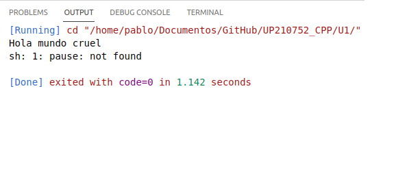

# UP210752 / Programación / Unidad 1
 
<h2>

Unidad 1 evidencia de desempeño de trabajos echos en clase.
</h2>
 

---
<h3>Índice</h3>
<h3 align="middle">Unidad 1</h3>
1. Hola mundo  
2. Par e impar 
3. Tipos de datos  
4. Ciclos 
5. Edades 

---
<b>Hola mundo cruel</b>
 [Este programa imprime un mensaje: "Hola mundo cruel"]

<pre>

int main()
{
    cout << "Hola mundo cruel"<< endl;
    system("pause");
    return 0;
} 
</pre> 

<b>Salida:</b>

 

---

<b>Par e impares</b> 
[Este programa imprime un mensaje "Pares e impares"]

<pre>
#include <iostream>
using namespace std;

int main()
{
    cout << "Par o impar \n"<< endl;
    return 0;
}
</pre>

<b>Salida:</b>

---

<b>Tipos de datos</b>
 Este programa imprime información sobre las variables de c++ 
<pre>
#include <iostream>
#include <stdio.h>

using namespace std;

int main(int argc, char const *argv[])
{
    int entero =2142234;
    float flotante = 3.4e38;
    double grande = 2.32334534;
    char caracter = '@';

    cout << "Este programa muestra los tipos de variables \n";
    cout << "El número entero es: " << entero << endl;
    cout << "El tamaño del entero es: " << sizeof(entero) << "bytes"<< endl;
    cout << "El número del flotante es: " << sizeof(flotante) << "bytes" << endl;
    return 0;
}
</pre>

 

<b>Salida:</b>

--- 

<b>Ciclos</b>
 
[Uso de ciclos para contar números pares e impares]
<pre>
int main()
{
    int n = 10;
    int suma = 0;
    int pares=0;
    int impares=0;
    int total=0;

    for (int i = 0; i <= n; i++)
    {      
        suma = suma + i;
        if (i % 2==0){
            pares=pares+1;
        }
        else{
            impares=impares+1;
        }

        total=total+1;
    }
    /*
    Salida
    */
    printf("Hay %d numeros pares\n",pares);
    printf("Hay %d numeros impares\n",impares);
    printf("Hay %d numeros en total\n",total);
    printf("La suma de %d numeros es %d ",n,suma);
    printf("\n");

    return 0;
}
</pre>
 
<b>Salida:</b>
 

---

<b>Edades</b>

 
Por medio de intervalos el usuario ingresa su edad y se le indica en que etapa está viviendo
 
<pre>
#include <iostream>
#include <stdio.h>

using namespace std;

int main()
{
    int edad;
    printf("Ingrese su edad límite 150 \n");
    scanf("%d", &edad);
    
    if (edad >= 1 && edad <= 150){
        if (edad >= 1 && edad <= 30){

            printf("Primera edad \n");
        }
        else if (edad >= 31 && edad <= 60){

            printf("Segunda edad \n");
        }
        else if (edad >= 61 && edad <= 90)
        {
            printf("Tercera edad \n");
        }
        else if (edad>=91 && edad<=150){

            printf("Horas extras :O \n");
        }
    
        
    }
    else{

    printf("Número invalido \n");
    }

return 0;
}

</pre>

 

<b>Salida:</b>

