# Unidad 2

<b>Rentas</b>

 
[Muestra el impuesto que correspondiente a la renta anual]
<pre>
#include <iostream>
#include <stdio.h>

using namespace std;

main(){

float renta;

printf("Ingresa tu renta anual:");
scanf("%f", &renta);

if(renta>=1){
    if (renta<10000){
        printf("Tu impuesto es de 5% \n");
    }else if (renta>=10000 && renta<20000) {
        printf("Tu impuesto corresponde a: 15% \n");
    }else if(renta>=20000 && renta<35000){
        printf("TTu impuesto corresponde a: 20% \n");
    }else if(renta>=35000 && renta<=60000){
        printf("Tu impuesto corresponde a: 30% \n");
    }else {
        printf("Tu impuesto corresponde a: 45% \n");
    }
}

}
</pre> 

<b>Salida:</b>

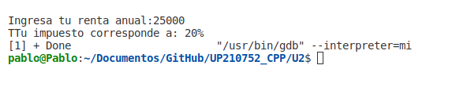
   

---

<b>Puntaje</b>

 
[Ingresa tu puntaje y te muestra la recompensa que te corresponde]

<pre>
#include <iostream>
#include <cmath>
#include <math.h>
using namespace std;

int main(int argc, char const *argv[])
{
    float p;
    int n;
    printf("¿Cual es tu puntuacion? \n");
    scanf("%f",&p);
    
    if(p==0.0 || p==round(0.4) || p>=0.6)
    {
        if (p==0.0)
        {
            n=2400*0.0;
            printf("Tu nivel es inaceptable :(  y recibirás %d $ \n",n);
        }else if(p==0.4)
        {
            n=2400*0.4;
            printf("Tu nivel es aceptable ._. y recibirás %d $ \n",n);
        }else if(p>=0.6)
        {
            n=2400*p;
            printf("Tu nivel es meritorio :) y recibirás %d $ \n",n);
        }
        
    }

    return 0;
}

</pre>

<b>Salida:</b>

 
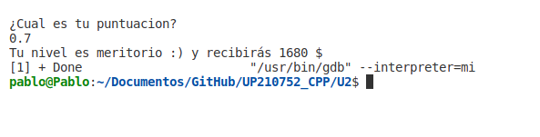
   

---

<b>Salas<b>

 
[Precio de la entrada según una edad ingresada]
<pre>
#include <iostream>
#include <stdio.h>
using namespace std;

int main()
{
    int edad;
    cout << "ingresa la edad" << endl;
    cin >> edad;

    if (edad < 4)
    {
        cout << "Entrada gratis :)";
    }
    else if (edad >= 4 & edad <= 18)
    {
        cout << "Precio de la entrada: $5.00";
    }
    else if (edad > 18)
    {
        cout << "Precio de la entrada: $10.00";
    }
    return 0;
}
</pre>

<b>Salida:</b>

 
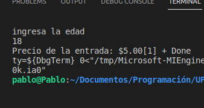 

---

<b>Pizzeria</b>

 
[Pide los ingredientes de una pizza vegetariana o normal]

<pre>

using namespace std;

int main(int argc, char const *argv[])
{
   string i = "";
   string r = "";
   
   cout << "¿Tu pizza es vegetariana?" << endl;
   cin >> r;

   if (r == "si")
   {
      cout << "La pizza lleva: Pimiento y tofu"<< endl;
      cout<< "¿De que quieres la pizza?"<<endl;
      cin >> i;
      if (i == "pimiento")
      {
         cout << "Ha escogido pimiento: Su orden contiene mozarella, tomate y pimiento"<<endl;
      }
      else if (i == "tofu")
      {
         cout << "Ha escogido tofu: Su orden contiene mozarella, tomate y tofu." << endl;
      }
   }
   else if (r == "no")
   {
      cout << "Los ingredientes son: peperonni, jamón y salmon"<<endl;
      cout<<"¿De que quieres tu pizza?"<<endl;
      cin >> i;
      if (i == "peperonni")
      {
         cout << "Ha escogido peperonni: Su orden contiene mozarella, tomate y peperonni." << endl;
      }
      else if (i == "jamon")
      {
         cout << "Ha escogido jamon: Su orden contiene mozarella, tomate y jamon."<<endl;
      }
      else if (i == "salmon")
      {
         cout << "Ha escogido salmon: Su orden contiene mozarella, tomate y salmon."<<endl;
      }
   }

   return 0;
}
</pre>

<b>Salida:</b>

 
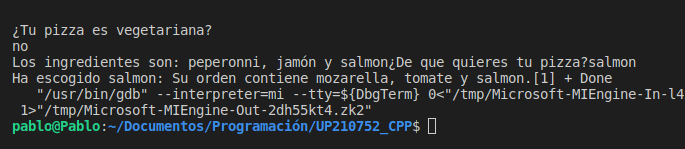 
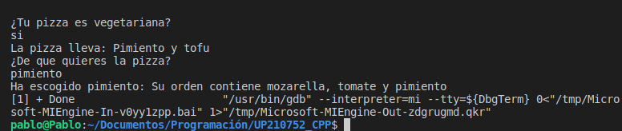

---

<b>Temperaturas</b>

 
[Según 6 temperaturas ingresadas saca, promedio, mayor y menor]

<pre>
using namespace std;
int main(int argc, char const *argv[])
{
    int temperatura[5];
    int s = 0, promedio, mayor = 0, menor = 0;

    cout << "Ingrese 6 temperaturas" << endl;
    for (int i = 0; i <= 5; i++)
    {
        cout << "Ingrese la "<< i <<" temperatura " <<endl;
        cin >> temperatura[i];
        s = s + temperatura[i];
    }

    mayor = temperatura[0];
    menor = temperatura[0];

    for (int i = 0; i <= 5; i++)
    {
        if (temperatura[i] >= mayor)
        {
            mayor = temperatura[i];
        }
        else if (temperatura[i] < menor)
        {
            menor = temperatura[i];
        }
    }

    promedio = s / 6;
    cout << "El promedio de las temperaturas ingresadas es: " << promedio << endl;
    cout << "El mayor de las temperaturas ingresadas es: " << mayor << endl;
    cout << "El menor de las temperaturas ingresadas es: " << menor << endl;
    return 0;
}
</pre>

<b>Salida:</b>

 
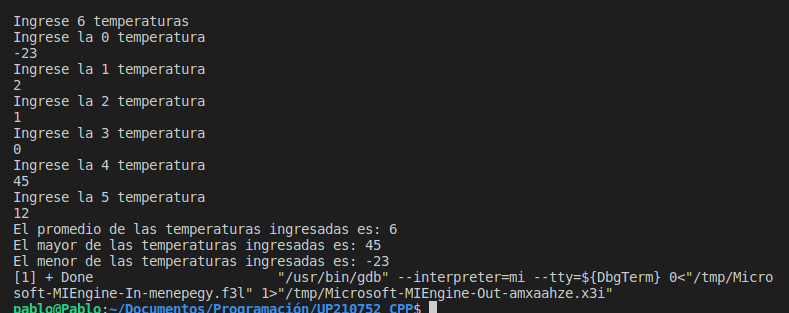 
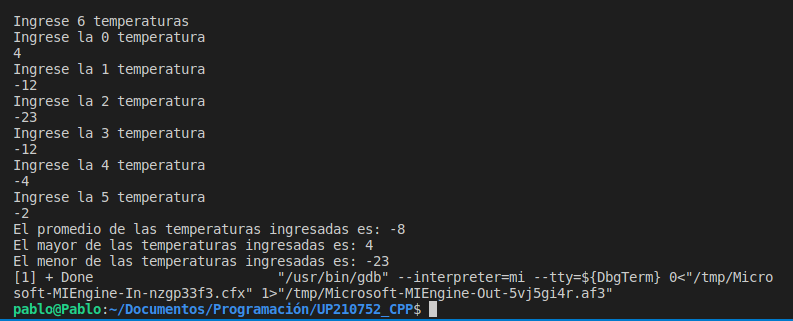 

---

<b>Productos</b>

 
[Se ingresan productos hasta que el usuario ingrese un 0, al final muestra el total]

<pre>
#include <iostream>

using namespace std;

int main()
{
    double costo;
    int bandera, total=0, i=1;
    do
    {
        cout << "Precio " << i << ":" <<endl;
        i=i+1;
        cin >> costo;
        total = total + costo;
        bandera = bandera + 1;
    } while (costo != 0);
    cout << "Total: $" << total<<endl;
    return 0;
}
</pre>

<b>Salida:</b>

 
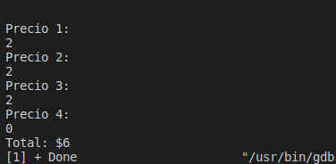 
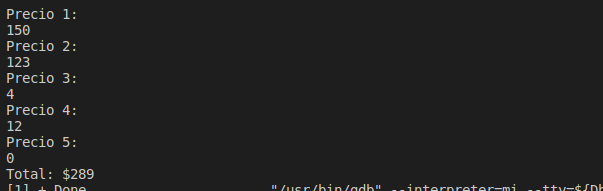

---

<b>Decimal a binario</b>

 
[El usuario ingresa un número decial y lo convierte a binario]

<pre>
#include <iostream>
#include <stdio.h>
#include <string>
using namespace std;
int main(){
    int n;
    string b="";
    float c;
    cout<<"Introduzca un número";
    cin>>n;
    if(n>0)    {
        while (n>0)
        {
            if (n%2==0)
            {
                b="0"+b;
            }else{
                b="1"+b;
            }
            n=(int) n/2;
        }
    }
    cout << "El resultado es: " << b << endl;  

    return 0;
}
</pre>

<b>Salida:</b>

 
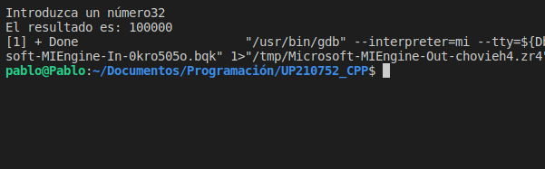 
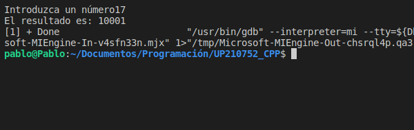

---

<b>ABC</b>

 
[Imprime el abecedario en un diferente orden]

<pre>
#include <iostream>
using namespace std;

int main(int argc, char const *argv[])
{
    char l= 'A';
    char l1= 'a';
    char l2= 'z';
    char l3= 'Z';

    for(int i=0; i<26; i++)
    {
        printf("%c \t", l);
        l=l+1;
    }
    printf("\n");
    printf("\n");
    for(int i=0; i<26; i++)
    {
        printf("%c \t", l1);
        l1=l1+1;
    }
    printf("\n");
    printf("\n");
    for(int i=0; i<26; i++)
    {
        printf("%c \t", l2);
        l2=l2-1;
    }
    printf("\n");
    printf("\n");
    for(int i=0; i<26; i++)
    {
        printf("%c \t ", l3);
        l3=l3-1;
    }
    printf("\n");
    printf("\n");

    return 0;
}
</pre>

<b>Salida:</b>

 
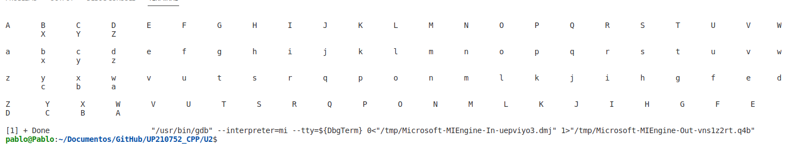 

---

<b>Tablas</b>

 
[Uso de ciclos para imprimir las tablas de multiplicar]

<pre>
#include <iostream>
#include<stdio.h>
using namespace std;

int main(int argc, char const *argv[])
{
    int n;
    int r=0;
    int conti = 10;
    int cont=1;
    int a=1;
    int b=10;

    printf("Ingresa un número");
    scanf("%d", &n);
     printf ("\n");

    for (int i=1; i<=10; i++)
    {
        r=n*i;
        printf("%d x %d = %d ", n ,i, r);
        printf ("\n");
    }
     printf ("\n");
    r=0;

    for (int j=10; j>=1; j--)
    {
        r=n*j;
        printf("%d x %d = %d ", n ,j, r);
        printf ("\n");
    }
    r=0;

    printf ("\n");

    while (cont<=10)
    {
        r=n*cont;
        printf("%d x %d = %d ", n ,cont, r);
        printf ("\n");
        cont=cont+1;
    }

     printf ("\n");

    while (conti>=1)
    {
        r=n*conti;
        printf("%d x %d = %d ", n ,conti, r);
        printf ("\n");
        conti=conti-1;
    }

    printf ("\n");

    do{
        r=n*a;
        printf("%d x %d = %d ", n ,a, r);
        printf ("\n");
        a=a+1; 
    }while (a<=10);

    printf ("\n");

    a=10;
    do{
        r=n*a;
        printf("%d x %d = %d ", n ,a, r);
        printf ("\n");
        a=a-1; 
    }while (a>=1);
    

    return 0;
}

</pre>

<b>Salida:</b>

 
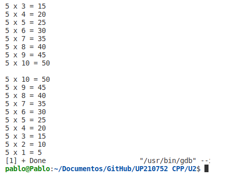

---

<b>While</b>

 
[ Muestra la tabla de multiplicar con ciclo while]

<pre>
#include <iostream>
using namespace std;

int main(int argc, char const *argv[])
{
    int n, i;
    char opcion='s';
    printf ("Tabla de multiplicar \n");

    while (opcion=='s')
    {
        printf("Numero:");
        scanf("%d", &n);

        i= 1;
        do
        {
            printf("%d x %d = %d \n", n,i,n*1);
            i++;
        } while (i<=10);
        

        printf("\n ¿Continuar? ");
        scanf("%s", &opcion);

    }
    printf("USER INTERRUPTION");
    return 0;
}
</pre>

<b>Salida:</b>

 
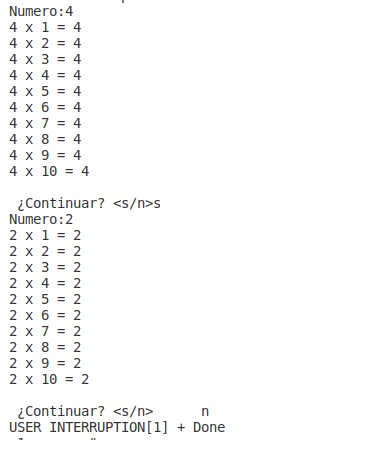
   

---

<b>For</b>

 
[Imprime las tablas de multiplicar del 1 al 10 con ciclo for]
<pre>
#include <iostream>
using namespace std;

int main(int argc, char const *argv[])
{
    int r=0;

    for (int i =1; i<=10; i++)
    {
        for(int j =1; j<=10; j++)
        {
            r=i*j;
            printf("%d x %d = %d",i,j,r);
            printf("\n");
        }
    
        printf("\n");
    }
    return 0;
}

</pre>

<b>Salida:</b>

 
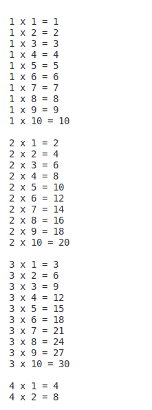