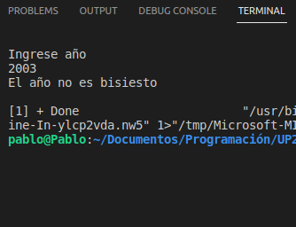

# Unidad 3

<b>Bisections</b>

 
[Finds the square of a ecuation]
<pre>
double x1 =4.5;
    double x2 = -10;
    double xm;

    double Es = 0.000001;          //Error estándar o error absoluto
    double Er = abs(x2-x1);     //Error relativo 

    int i=1;

    while (Er>Es)
    {
        xm=(x1+x2)/2;
        if (fnEcuacion1(x1)*fnEcuacion1(xm) < 0)
        {
            x2=xm;
        }else{
            x1=xm;
        }
        Er=abs(x2-x1);
        i=i+1;
    }
    cout <<"i= " << i << " Raíz=" << xm << endl;
    cout << ". . . Hecho";
    double y;
    // y=fnEcuacion1(0);
    // cout << y << endl;
    return 0;
</pre> 

<b>Print:</b>

   

---

<b>Leap year</b>

 
[Function that calculates if a year is leap or not]
<pre>
bool bis(int año){
    if (año%400==0 || ( año%4==0 && año%100!=0 )){
        return true;
    }else{
        return false;
    }
}

int main(){
    int year;
    cout << "Ingrese año" << endl;
    cin >> year;

    if (bis(year)==true){
        cout << "El año es bisiesto" << endl;
    }else {
        cout << "El año no es bisiesto" << endl;
    }
    return 0;
}
</pre> 

<b>Print:</b>

   

---

<b>Cosine function</b>

 
[Calculates cosine function of an angle]
<pre>
long double factorial (int num)
{
    long double ft=1.0;

    for (int i=1; i<=num; i++){
        ft=ft*i;
    }
    return ft;
}

double radianes(double grados){
    return grados * PI/180;
}

double cos(double x){
    double resultado=0;
    for (int i = 0; i <= n; i++)
    {
        resultado=resultado+(pow(-1, i)*((pow(x, 2*i))/factorial(2*i)));
    }
    return resultado;
}
int main(){ 
    double angulo=radianes(60), print;
    print=cos(angulo);
    cout <<"Coseno de 60° igual a "<< print<< endl;
    return 0;
}
</pre> 

<b>Print:</b>

   

---

<b>Standard deviation</b>

 
[Calculates the standard deviation ]
<pre>
float xi[5]={600.0, 470.0, 170.0, 430.0, 300.0};
    float media=394.0;
    float desviacion=0.0;
    float resultado=0.0;        
    for (int i = 0; i <=5; i++)
    {
        desviacion=sqrt(pow((xi[i]-media)*1/5, 2));
        resultado=resultado + desviacion;
    }
    cout<<"Desviación="<<resultado<<endl;
</pre> 

<b>Print:</b>

   

 ---

<b>Money change</b>

 
[Takes the best option change to give to a user]
<pre>
int pago;
    cin>>pago;
    int resultado=0;
    resultado=pago/1000;
    pago%=1000;
    cout<<"Billete de 1000"<< resultado<< endl;
    resultado=pago/500;
    pago%=500;
    cout<<"Billete de 500"<< resultado<< endl;    
    resultado=pago/200;
    pago%=200;
    cout<<"Billete de 200"<< resultado<< endl;
    resultado=pago/100;
    pago%=100;
    cout<<"Billete de 100"<< resultado<< endl;
    resultado=pago/50;
    pago%=50;
    cout<<"Billete de 50"<< resultado<< endl;
    resultado=pago/20;
    pago%=20;
    cout<<"Billete de 20"<< resultado<< endl;
    resultado=pago/10;
    pago%=10;
    cout<<"Billete de 10"<< resultado<< endl;
    resultado=pago/5;
    pago%=5; 
    cout<<"Billete de 5"<< resultado<< endl;    
    resultado=pago/2;
    pago%=2;
    cout<<"Billete de 2"<< resultado<< endl;
    resultado=pago/1;
    pago%=1;
    cout<<"Billete de 1"<< resultado<< endl;</pre> 

<b>Print:</b>

   

---

<b>Roman numbers</b>

 
[Converts arabig numbers  into roman]
<pre>
int x;
    cout<<"ingrese un numero"<<endl;
    cin>>x;
  if((x<1)||(x>999))
       cout<<"Ingrese un numero entre 0-999"<<endl;
  else
   
   {
 
        if(x>=900)   {cout<<"CM"   ;x=x-900; }
        if(x>=500)   {cout<<"D"    ;x=x-500; }
        if(x>=400)   {cout<<"CD"   ;x=x-400; }
        if(x>=300)   {cout<<"C"    ;x=x-100; }
        if(x>=200)   {cout<<"C"    ;x=x-100; }
        if(x>=100)   {cout<<"C"    ;x=x-100; }
        if(x>=90)    {cout<<"XC"   ;x=x-90;  }
        if(x>=50)    {cout<<"L"    ;x=x-50;  }
        if(x>=40)    {cout<<"XL"   ;x=x-40;  }
        if(x>=30)    {cout<<"X"    ;x=x-10;  }
        if(x>=20)    {cout<<"X"    ;x=x-10;  }
        if(x>=10)    {cout<<"X"    ;x=x-10;  }
        if(x>=9) {cout<<"IX"   ;x=x-9;   }
        if(x>=5) {cout<<"V"    ;x=x-5;   }
        if(x>=4) {cout<<"IV"   ;x=x-4;   }
        if(x>=3) {cout<<"III";x=x-3;     }
        if(x>=2) {cout<<"II"   ;x=x-2;   }
        if(x>=1) {cout<<"I"    ;x=x-1;   }
  
    }
   cout<<endl;
</pre> 

<b>Print:</b>

   

---

<b>RFC</b>

 
[User enter his name, last names and his birthday and then print his FRC]
<pre>
char apellidoP[100], apellidoM[100], Nombre[100], rfc[100], year[100]; 
    cout<<"Ingresa el apellido paterno"<<endl; 
    cin>>apellidoP; 
    cout<<"Ingresa el apellido materno "<<endl; 
    cin>>apellidoM; 
    cout<<"Ingrese solo su primer nombre "<<endl; 
    cin>>Nombre; 
    cout<<"Ingresa tu fecha de nacimiento"<<endl;  
    cin>>year; 
     
    rfc[0] = apellidoP[0]; 
    rfc[1] = apellidoP[1];
    rfc[2] = apellidoM[0]; 
    rfc[3] = Nombre[0]; 
    strcat(apellidoP, apellidoM);
    strcat(apellidoM, Name);
    strcat(Name, year);

    cout<<rfc<<year<<endl;

    return 0; 
</pre> 

<b>Print:</b>

   

---

<b>Sort a array</b>

 
[User gives five numbers and the program sort in ascending and descending way]
<pre>
void ordenar_asc(int [], int);
void ordenar_des(int [], int);
int main()
{
 
 int xn;
 int num[9];
 
 for (int i=1;i<=5;i++){
  cout <<"Ingrese numero : "<<endl;
  cin>>num[i];
  
 }
 cout <<"Orden ascendente "<<endl;
 ordenar_asc(num,5);
 
 for (int i=1;i<=5;i++){
  cout <<num[i]<<endl;
  
 }
 cout <<"Orden descendente "<<endl;
 ordenar_des(num,5);
 
 for (int i=1;i<=5;i++){
  cout <<num[i]<<endl;
  
 }
 return 0;
}

void ordenar_asc(int a[], int n)
{
   int aux;
   for (int i=n; i>=0; i--)
      for (int j=0; j<=i; j++)
         if (a[j] > a[j+1])
          {
            aux = a[j];
            a[j]= a[j+1];
            a[j+1]= aux;
           }
}

void ordenar_des(int a[], int n)
{
   int aux;
   for (int i=n; i>=0; i--)
      for (int j=0; j<=i; j++)
         if (a[j] < a[j+1])
          {
            aux = a[j];
            a[j]= a[j+1];
            a[j+1]= aux;
           }
}
</pre> 

<b>Print:</b>

   

---

<b>Recursive function</b>

 
[Recursive function that power a base given for the user]
<pre>
long int potencia(int base,int e){
    if(e==0) return 1;
    if(e==1) return base;
    else return base*potencia(base,e-1);
}
int main( void ){
    int b,e;
    cout<<"Ingrese la base"<<endl;
    cin>>b;

    do{
            cout<<"Ingrese un exponente";
            cin>>e;
    }while(e<0);
    cout<<endl;
    cout<<"Base:"<<b<<endl;
    cout<<"Exp:"<<e<<endl;
    cout<<"Resultado:"<<potencia(b,e)<<endl<<endl;

    return 0;
}
</pre> 

<b>Print:</b>

   

---