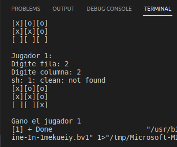
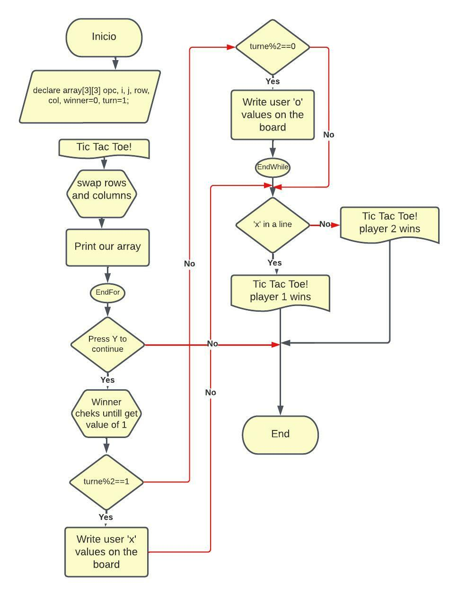

* UNIT 4 PORTFOLIO EVIDENCE

<b>Tic Tac Toe</b>

 
[The user can play tic tac toe vs another player]
<pre>
int main(){
	
	char matriz[3][3], opc;
	int i, j;
	
	printf("Juego del gato!\n");
	
	
	for(i=0; i<3; i++){
		for(j=0; j<3; j++){
			matriz[i][j]=' ';
			printf("[%c]", matriz[i][j]);
		}
		printf("\n");
	}
	
	printf("\n\nPresione Y para jugar / N para salir: ");
	scanf("%c", &opc);
	
	int fila, col, ganador=0, turno=1;
	
	if(opc == 'Y' || opc == 'y'){
		
		do{
			if(turno%2==1){
				do{
					printf("\nJugador 1: \n");
					printf("Digite fila: ");
					scanf("%d", &fila);
					printf("Digite columna: ");
					scanf("%d", &col);
					
					if(matriz[fila][col] == 'x' || matriz[fila][col] == 'o' || fila > 2 || col > 2){
						printf("\nCoordenadas no validas, pruebe otra vez.\n");
					}
				}while(matriz[fila][col] == 'x' || matriz[fila][col] == 'o' || fila > 2 || col > 2);
				
				matriz[fila][col]='x';
				
				system("clean");
				for(i=0; i<3; i++){
					for(j=0; j<3; j++){
						printf("[%c]", matriz[i][j]);
					}
					printf("\n");
				}
				turno++;
			} else if(turno%2==0){
				do{
					printf("\nJugador 2: \n");
					printf("Digite fila: ");
					scanf("%d", &fila);
					printf("Digite columna: ");
					scanf("%d", &col);
					
					if(matriz[fila][col] == 'x' || matriz[fila][col] == 'o' || fila > 2 || col > 2){
						printf("\nCoordenadas no validas, pruebe otra vez.\n");
					}
				} while(matriz[fila][col] == 'x' || matriz[fila][col] == 'o' || fila > 2 || col > 2);
				
				matriz[fila][col]='o';
				
				system("clear");
				for(i=0; i<3; i++){
					for(j=0; j<3; j++){
						printf("[%c]", matriz[i][j]);
					}
					printf("\n");
				}
				turno++;
			}
			//posiciones ganadores de jugador 1
			if(matriz[0][0] == 'x' && matriz[0][0] == matriz[0][1] && matriz[0][0] == matriz[0][2]
			|| matriz[1][0] == 'x' && matriz[1][0] == matriz[1][1] && matriz[1][0] == matriz[1][2]
			|| matriz[2][0] == 'x' && matriz[2][0] == matriz[2][1] && matriz[2][0] == matriz[2][2]
			
			|| matriz[0][0] == 'x' && matriz[0][0] == matriz[1][0] && matriz[0][0] == matriz[2][0]
			|| matriz[0][1] == 'x' && matriz[0][1] == matriz[1][1] && matriz[0][1] == matriz[2][1]
			|| matriz[0][2] == 'x' && matriz[0][2] == matriz[1][2] && matriz[0][2] == matriz[2][2]
			
			|| matriz[0][0] == 'x' && matriz[0][0] == matriz[1][1] && matriz[0][0] == matriz[2][2]
			|| matriz[0][2] == 'x' && matriz[0][2] == matriz[1][1] && matriz[0][2] == matriz[2][0]){
				ganador=1;
				printf("\nGano el jugador 1\n");
			}
			//posiciones ganadores de jugador 2
			if(matriz[0][0] == 'o' && matriz[0][0] == matriz[0][1] && matriz[0][0] == matriz[0][2]
			|| matriz[1][0] == 'o' && matriz[1][0] == matriz[1][1] && matriz[1][0] == matriz[1][2]
			|| matriz[2][0] == 'o' && matriz[2][0] == matriz[2][1] && matriz[2][0] == matriz[2][2]
			
			|| matriz[0][0] == 'o' && matriz[0][0] == matriz[1][0] && matriz[0][0] == matriz[2][0]
			|| matriz[0][1] == 'o' && matriz[0][1] == matriz[1][1] && matriz[0][1] == matriz[2][1]
			|| matriz[0][2] == 'o' && matriz[0][2] == matriz[1][2] && matriz[0][2] == matriz[2][2]
			
			|| matriz[0][0] == 'o' && matriz[0][0] == matriz[1][1] && matriz[0][0] == matriz[2][2]
			|| matriz[0][2] == 'o' && matriz[0][2] == matriz[1][1] && matriz[0][2] == matriz[2][0]){
				ganador=1;
				printf("\nGano el jugador 2\n");
			}
			
		} while(ganador != 1);
	} else {
		system("clear");
		printf("\nVuelva a ejecutar el programa\n");
	}
	
	return 0;
}
</pre> 

---

<b>Print:</b>

   

---

<b>Flowchart:</b>

